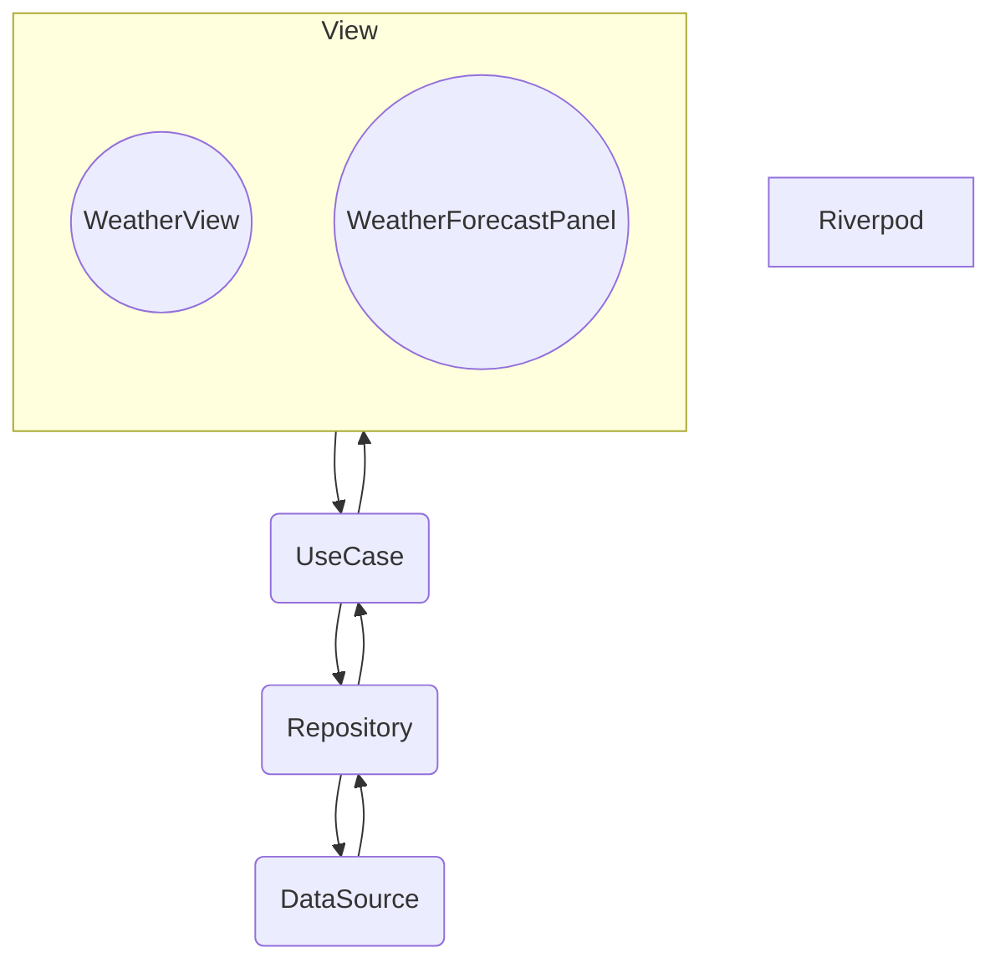
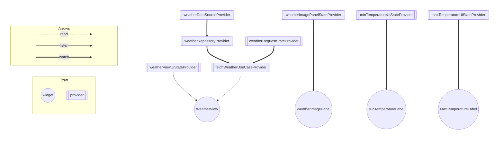

# 全体

- View

  - 取得した天気情報の表示や、エラー時にダイアログを表示。
YumemiWeather APIの実行ボタンのUIなどを提供。

- UseCase

  - 取得結果に応じて、各種Providerの更新。

- Repository

  - DataSourceをResultクラスに変換。

- DataSource

  - Weatherを取得するロジックを提供。
  - YumemiWeatherErrorのハンドリング。

## View
- 取得した天気情報の表示したり、エラー時にダイアログを表示させたりする。
### WeatherView
- 画面全体
- WeatherViewUiStateで、「初期 or エラー」を管理
### WeatherForecastPanel
- WeatherViewのコンポーネント
- 以下のUIを提供し、各々状態を管理する。
  - Temperature
  - WeatherImagePanel

## UseCase
- 取得結果に応じて各種Providerの更新。
### 取得成功時
- WeatherForecastPanelを取得結果で更新。
### 取得失敗時
- WeatherViewUiStateを「エラー状態」に更新。
## Repository
- DataSourceをResultクラスに変換。

## DataSource
- Weatherを取得するロジックを提供。
- YumemiWeatherErrorのハンドリング。
- API通信を実行する。
- YumemiWeatherErrorをアプリ内エラークラス（AppError）に変換。

## Riverpodの依存関係
